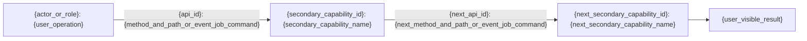

# {project_name} · {level1_capability_name} 一级能力接口详情设计

> 文档状态：评审中<br>
> 文档版本：{revision}<br>
> 能力标识：`{level1_capability_id}`<br>
> 上游业务架构：`architecture/business.md`<br>
> 业务清单：`business/inventory.yaml`<br>
> 证据基线：{source_commit}

> 用户旅程设计完整性：`user_journey_design_status=detailed` · `user_journey_coverage={complete_or_partial}` · `user_journey_gap_id={gap_id_or_not_applicable}`
> 一级能力依赖投影：`dependency_graph_status={pending_level1_completion_or_derived}` · `dependency_graph_revision={not_derived_or_revision}` · `dependency_graph_gap_id={gap_id_or_not_applicable}`

[返回业务架构](architecture/business.md) · [上一个能力]({previous_capability_document_path}) · [下一个能力]({next_capability_document_path})

本文件是 `{level1_capability_name}` 唯一的一级能力接口详情设计。它回答“对外提供什么业务能力、用户怎样使用、这项业务如何由一个或多个二级能力通过接口协作实现、使用了哪些表及它们如何关联”，并链接对应二级能力详细设计。

一级文档保留对外业务能力、跨二级能力实现逻辑、Controller/Handler、Service/UseCase、数据结果、表结构和 ER 关系。字段级接口契约、完整调用链、Mapper/Repository 实现、单接口事务/并发/容错及测试矩阵仍由二级能力文档的对应 `5.N` 接口分组负责。

## 1. 设计结论与能力边界

说明本能力为哪些用户/角色提供哪些业务价值、覆盖哪些二级能力/模块、与相邻一级能力如何分工，以及证据不足的边界。结论只能来自业务架构、清单、仓库证据或明确的人工确认。上游和下游不得由本文件单独推断，只能从项目级统一模型梳理得到的 canonical 依赖图投影。

| 字段 | 内容 | 来源 |
| --- | --- | --- |
| `level1_capability_id` | `{level1_capability_id}` | `business/inventory.yaml` |
| `level1_capability_name` | `{level1_capability_name}` | `business/inventory.yaml` |
| 纳入范围 | {included_scope} | {evidence_ref} |
| 排除范围 | {excluded_scope} | {evidence_ref} |
| 主要用户/角色 | {actors} | {evidence_ref} |
| 上游能力 | `{direct_upstream_capability_ids_or_not_derived}` | `business/level1-capability-dependency-graph.yaml` |
| 下游能力 | `{direct_downstream_capability_ids_or_not_derived}` | `business/level1-capability-dependency-graph.yaml` |

依赖投影规则：

- 先完成 inventory 中全部一级能力总览和全部所属二级能力接口设计；只要任一一级 `user_journey_coverage=partial` 或任一二级 `interface_coverage=partial`，项目图保持 `pending_level1_completion`，本表上下游都必须写 `not_derived`；
- 全部文档完整后，`axis-doc-project-knowledge` 一次性读取完整 inventory、全部当前一级总览和二级追溯，由模型进行项目级统一模型梳理，生成 `business/level1-capability-dependency-graph.yaml`；
- `derived` 状态下，上游能力严格等于 canonical 图中指向本能力的直接入边来源，下游能力严格等于从本能力发出的直接出边目标；没有直接关系时使用 `[]`；
- 禁止局部手工修订某一份总览的上下游。一级能力集合、边界或关系证据变化时，先把图和所有投影退回 pending，再统一派生并批量回填。

本文件的历史版本进入 `_archive`。二级能力独立修订和存档；只有对外业务能力、一级边界、专业语义、表结构、跨能力协作或导航发生变化时才修订本文件。

## 2. 二级能力完整性与导航

先从 inventory 读取完整 `secondary_capabilities`，再生成紧凑导航表。不得遗漏任何二级能力。长业务摘要和证据按二级能力放在导航表后的纵向补充说明中，不得继续扩展导航表列数。

| 顺序 | `secondary_capability_id` | 二级能力名称 | 对应 `business_id` | 二级能力文档 | 文档状态 |
| --- | --- | --- | --- | --- | --- |
| 1 | `{secondary_capability_id}` | {secondary_capability_name} | `{business_ids}` | [打开详细设计](business/capabilities/{level1_capability_id}/secondary-capabilities/{secondary_capability_id}/detailed-design.md) | review |

#### 二级能力 `{secondary_capability_id}` 补充说明

| 项目 | 内容 |
| --- | --- |
| 提供的业务摘要 | {business_summary} |
| 证据/置信度 | {evidence_ref} |

完整性规则：

- inventory 中每个二级能力在本表恰好出现一次；
- 每行列出全部 `business_ids`，并链接唯一的当前二级能力文档；
- 每个已声明二级能力至少参与第 3 章一项有证据的对外业务能力；
- 缺失证据的二级能力仍保留清单行和独立文档并标记，不得删除以制造完整假象；
- Dashboard 以本表和规范路径构建可折叠父子导航。

## 3. 对外业务能力与接口实现

模型必须根据当前业务清单、页面/菜单、路由、API、事件、任务、代码与测试证据，逐项识别本一级能力对外提供的真实业务能力。这不是固定清单，也不是按二级能力或接口一对一分组；应按用户目标和用户可见结果划分业务能力，为每项能力生成一个连续的 `3.N` 小节。禁止用一张横向宽表代替这些小节。

同一项对外业务能力使用一个稳定 `journey_id`，可以由一个或多个二级能力通过多个接口协作完成。跨二级能力的业务接力、顺序和结果直接由该 `3.N` 的逻辑图和实现步骤表达，不再生成独立的“跨二级能力用户旅程”章节。每个 `3.N` 必须严格按 `3.N.1 业务说明`、`3.N.2 二级能力与接口实现逻辑`、`3.N.3 实现步骤` 的顺序且各出现一次，不得交换、跳过、合并或添加平行替代小节。

### 3.1 {provided_business_capability_name}

#### 3.1.1 业务说明

| 项目 | 内容 |
| --- | --- |
| `journey_id` | `{journey_id}` |
| 用户/角色 | {actor_or_role} |
| 提供的业务 | {provided_business} |
| 用户目标 | {user_goal} |
| 用户怎么操作 | {user_operation} |
| 用户可见结果 | {user_visible_result} |
| 参与二级能力 | `{participating_secondary_capability_ids}` |
| 证据 | `{business_evidence_path_begin_end_symbol}` |

#### 3.1.2 二级能力与接口实现逻辑

以二级能力为主要节点，以实际 `api_id` 与完整 HTTP 方法及路径、事件主题、任务或命令组成同一条边标签，表达用户操作如何经过一个或多个二级能力得到最终结果。`api_id` 或接口不得画成独立节点；每个实现步骤都必须对应一条带“`api_id`: 完整接口”的边。多二级能力场景按 `step_id` 顺序把参与二级能力逐步连接起来，边的顺序、方向、二级能力和接口必须与 `3.N.3` 完全一致；外部发起方和最终结果只连接首尾二级能力。图中必须使用真实 ID、接口和结果，不得保留泛化节点。



#### 3.1.3 实现步骤

图中每个接口实现步骤都单独使用一张窄的“项目/内容”纵向表，顺序必须与图一致。

##### 步骤 {step_id}

| 项目 | 内容 |
| --- | --- |
| `step_id` | `{step_id}` |
| `secondary_capability_id` | `{secondary_capability_id}` |
| `api_id` | `{api_id}` |
| 接口/入口 | `{method_and_path_or_event_job_command}` |
| Controller/Handler | `{controller_or_handler_path_begin_end_symbol}` |
| Service/UseCase | `{service_or_use_case_path_begin_end_symbol}` |
| 读取数据 | {read_data_summary} |
| 写入/产生数据 | {written_or_produced_data_summary} |
| 读写 `table_id` | `{read_write_table_ids_or_not_applicable}` |
| 二级能力详情 | [查看二级能力详细设计](business/capabilities/{level1_capability_id}/secondary-capabilities/{secondary_capability_id}/detailed-design.md) |
| 证据 | `{step_evidence_path_begin_end_symbol}` |

生成规则：

- 为每项真实对外业务能力复制完整且固定顺序的 `3.N.1`、`3.N.2` 和 `3.N.3`；不得只选每个模块的代表接口；
- 一个 `journey_id` 可以有多个 `step_id`并参与多个二级能力；每个步骤只绑定一个 `secondary_capability_id` 和一个 `api_id`；
- `3.N.2` 中每个 `api_id` 与其完整接口必须共同作为连接二级能力节点（或外部发起方/结果与首尾二级能力）的边标签，不得作为节点或散落文本；多二级能力按 `3.N.3` 步骤顺序相连；
- 每个步骤的 Controller/Handler 与 Service/UseCase 都必须使用仓库相对 `path:begin-end#symbol` 精确锚点，不得用 `missing_evidence`、`not_applicable`、类名或模块名代替；
- 业务说明与每个实现步骤的“证据”至少包含一个仓库相对 `path:begin-end#symbol` 精确锚点；
- 一级 `journey_id` 必须在所有参与二级能力文档中以同值 `level1_journey_id` 出现，并绑定该二级能力承接的 `flow_id` 和/或 `api_id`；
- “读取数据”和“写入/产生数据”摘要业务对象、缓存、索引、事件或外部结果；“读写 `table_id`”固定列出该步骤直接或间接读写的一个或多个稳定 `table_id`，并与第 5 章及二级 `5.N.1` 同值。只有精确代码证据证明该步骤完全不读写持久化数据时才写 `not_applicable`，且步骤证据必须能支持这一结论；
- `table_design_status=detailed` 时，第 3 章全部步骤“读写 `table_id`”的去重并集必须与第 5 章表清单 `table_id` 集合严格相等，不得遗漏、额外添加或用物理表名替代稳定 ID。

## 4. 业务语义

逐项解释本一级能力中实际使用的业务、行业和领域专业术语。本章是读者理解业务的语义字典，不承载安全、隐私、发布、质量或运行治理规则。

| 专业术语 | 定义 | 适用场景与边界 | 易混淆术语及区别 | 关联二级能力 | 权威来源/证据 |
| --- | --- | --- | --- | --- | --- |
| {professional_term} | {definition} | {applicable_scenario_and_boundary} | {confusable_term_and_difference} | `{secondary_capability_ids}` | {authoritative_source_or_evidence} |

## 5. 表结构设计

> 表结构设计完整性：`table_design_status={detailed_or_not_applicable}` · `table_design_coverage={complete_partial_or_not_applicable}` · `table_design_gap_id={gap_id_or_not_applicable}`

`table_design_status=detailed` 时，本章必须完整列出该一级能力中由第 3 章接口直接或间接读写的所有持久化表，提供 ER 图，并为每张表给出字段设计。

`table_design_coverage=partial` 必须使用稳定 `table_design_gap_id` 追踪未覆盖表或字段证据；`complete` 使用 `table_design_gap_id=not_applicable`。

### 5.1 表清单

| `table_id` | 物理表名 | 业务实体/用途 | 所属二级能力 | 读写 `api_id` | 证据 |
| --- | --- | --- | --- | --- | --- |
| `{table_id}` | `{physical_table_name}` | {business_entity_or_purpose} | `{secondary_capability_ids}` | `{read_write_api_ids}` | `{ddl_migration_orm_mapper_or_query_path_begin_end_symbol}` |

### 5.2 ER 图

ER 图中的实体名称必须使用表清单逐项声明的实际物理表名或经批准的目标物理表名，不得使用 `table_id` 充当实体名。关系、基数和键必须有 DDL、迁移、ORM、Mapper/查询或已批准目标设计证据，不得凭表名猜测。

```mermaid
erDiagram
    {PHYSICAL_TABLE_A} ||--o{ {PHYSICAL_TABLE_B} : "{evidence_backed_relationship}"
    {PHYSICAL_TABLE_A} {
        {column_type} {primary_key_column} PK
    }
    {PHYSICAL_TABLE_B} {
        {column_type} {foreign_key_or_relation_column} FK
    }
```

#### 5.2.1 ER 关系证据

当表清单包含两张或更多表时，必须保留本表；每个 `table_id` 至少在“表关系（主 -> 从）”中出现一次，且每行证据都是支持关系、基数和关联键的精确仓库相对 `path:begin-end#symbol` 锚点。ER 图中的关系标签与本表“业务语义”必须逐条同值；图中不得出现表清单外的实体或本表未记录的关系。

| `relation_id` | 表关系（主 -> 从） | 关系/基数 | 关联键 | 业务语义 | 证据 |
| --- | --- | --- | --- | --- | --- |
| `{relation_id}` | `{primary_table_id}` -> `{secondary_table_id}` | `1:1` / `1:N` / `N:1` / `N:M` / 无直接关系 | `{primary_table_id}.{primary_key} -> {secondary_table_id}.{foreign_or_join_key}` / `not_applicable` | {relationship_business_semantics} | `{ddl_migration_orm_mapper_or_query_path_begin_end_symbol}` |

当表清单只有一张表时，删除上述关系证据表，并明确写：`ER 关系证据：not_applicable（单表，无需跨表关系）`。不得为满足模板虚构自关联或跨表关系。

### 5.3 `{physical_table_name}`

> 表标识：`table_id={table_id}`

| 字段 | 类型/可空/默认值 | 键/约束 | 业务语义 | 读写 `api_id` | 证据 |
| --- | --- | --- | --- | --- | --- |
| `{column_name}` | `{column_type}`；可空=是 / 否；默认值=`{default_value_or_none}` | {primary_unique_foreign_check_or_other_constraint} | {business_semantics} | `{read_write_api_ids}` | `{ddl_migration_orm_mapper_or_query_path_begin_end_symbol}` |

字段小节固定从 `5.3` 开始并按表清单顺序连续编号；每个 `table_id` 恰好对应一个字段小节，小节标题只写表清单中的实际物理表名（允许使用反引号），不得追加“字段设计”等通用后缀。表清单、以实际物理表名为实体的 ER 图、`5.2.1 ER 关系证据`、字段表与二级接口中的局部读写追溯必须一致。表清单 `table_id` 集合必须与第 3 章全部步骤“读写 `table_id`”的非 `not_applicable` 值去重并集严格相等。多表时 ER 关系证据覆盖每张表；单表时在 `5.2.1` 明确“无需跨表关系”。表清单、关系证据与每个字段行的“证据”都至少包含一个 DDL、迁移、ORM、Mapper 或查询的仓库相对 `path:begin-end#symbol` 精确锚点。

只有证据能够证明本一级能力不读写任何持久化数据时，才可使用 `table_design_status=not_applicable`。该分支的 coverage 和 gap ID 也都使用 `not_applicable`。此时删除上述表清单、ER 图和每表字段示例，但必须保留第 5 章并填写：

| 项目 | 内容 |
| --- | --- |
| `table_design_status` | `not_applicable` |
| 原因 | {no_persistence_reason} |
| 证据 | {exact_repository_evidence} |

## 6. 缺口与覆盖说明

### 6.1 对外业务能力覆盖缺口

每个缺口使用一张纵向表；复制下表而不是增加横向列。

| 项目 | 内容 |
| --- | --- |
| `user_journey_gap_id` | `{gap_id_or_not_applicable}` |
| 未覆盖对外业务能力/证据 | {missing_business_capability_or_evidence} |
| 涉及二级能力 | `{secondary_capability_ids}` |
| 已检查范围 | {searched_scope} |
| 影响 | {coverage_impact} |
| 所需证据/确认 | {required_evidence_or_decision} |
| 责任角色 | {owner_role} |
| 状态 | {gap_status} |

### 6.2 表结构设计缺口

| 项目 | 内容 |
| --- | --- |
| `table_design_gap_id` | `{gap_id_or_not_applicable}` |
| 未覆盖表/字段/关系证据 | {missing_table_field_relationship_or_evidence} |
| 已检查范围 | {searched_scope} |
| 影响 | {coverage_impact} |
| 所需证据/确认 | {required_evidence_or_decision} |
| 责任角色 | {owner_role} |
| 状态 | {gap_status} |

`user_journey_coverage=complete` 时，`user_journey_gap_id=not_applicable`；`table_design_coverage=complete` 时，`table_design_gap_id=not_applicable`。两者都不得用 `complete` 隐藏未扫描模块、未解释入口或未核验持久化证据。

## 7. 文档完整性校验

- `user_journey_design_status=detailed`，且 `user_journey_coverage` 只取 `complete|partial`；`partial` 具有稳定 `user_journey_gap_id`，`complete` 使用 `not_applicable`；
- `table_design_status` 只取 `detailed|not_applicable`；`detailed` 使用 `table_design_coverage=complete|partial`，`not_applicable` 时 coverage 和 gap ID 均为 `not_applicable` 且第 5 章具有原因和精确证据；
- inventory 中该 `level1_capability_id` 只对应一个当前一级能力接口详情设计，且每个二级能力恰好出现在完整性清单中并至少参与一项对外业务能力；
- 第 3 章的每项对外业务能力都有独立 `3.N`，并且仅按固定顺序包含一次 `3.N.1`、`3.N.2` 和 `3.N.3`；业务说明使用窄纵向表，Mermaid 以二级能力为节点并将 `api_id` 与完整接口作为边标签，多二级能力按步骤相连；
- 每个 `journey_id` 的用户目标、操作、可见结果、参与二级能力、`step_id`、`api_id`、入口、Controller/Handler、Service/UseCase、数据摘要、“读写 `table_id`”、二级链接和证据完整；
- 一级 `journey_id` 在每个参与二级文档中都有同值 `level1_journey_id`，每个实现步骤绑定对应子文档的 `flow_id` 和/或 `api_id`；一级为 `complete` 时所有子文档的接口覆盖也为 `complete`；
- 第 4 章只解释术语的定义、场景/边界、易混淆概念、关联二级能力和权威证据，不混入一级治理清单；
- `table_design_status=detailed` 时，第 5 章表清单集合与第 3 章步骤 `table_id` 并集严格相等，ER 使用清单中的实际物理表名，每表字段小节完整；多表具有覆盖每张表和精确关系证据的固定 `ER 关系证据` 表，单表明确无需跨表关系；`table_id`、物理表名、`api_id`、关系、键/约束和二级 `5.N.1` 证据一致；
- 本文件未复制字段级接口契约、完整调用链、Mapper/Repository 实现、单接口事务/并发/性能/容错或安全/测试/验收矩阵；这些仍属于对应二级 `5.N` 分组；
- 本详情设计能返回业务架构，并能导航到上一个能力、下一个能力和每份二级能力详细设计；
- `dependency_graph_status`、`dependency_graph_revision` 和 `dependency_graph_gap_id` 与项目级图一致；pending 时上下游均为 `not_derived`，derived 时分别精确等于直接入边和直接出边；
- 当前文件状态、revision、metadata、archive 和 `supersedes` 一致。

## 8. 文档导航与证据索引

- 返回业务架构：`architecture/business.md`；
- 上一个能力：`{previous_capability_document_path}`；
- 下一个能力：`{next_capability_document_path}`；
- 二级能力详细设计：列出本能力全部规范路径；
- 相关需求和功能文档：{related_requirement_and_feature_paths}；
- 证据按 architecture、inventory、routes、controllers、handlers、pages、menus、services、entities、mappers、migrations、tests、config 和 docs 分类列出；代码证据使用 `path:begin-end#symbol`。
