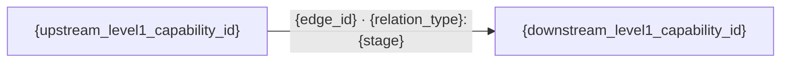

# {project_name} 业务架构文档

> 文档状态：评审中
> 业务范围：{business_scope}
> 证据基线：{source_commit}
> 采用方法：ISO/IEC/IEEE 42010:2022、TOGAF Business Architecture、ArchiMate-lite、GB/T 8567-2006

## 1. 文档目标与业务范围

说明业务架构的使用场景、覆盖范围、不覆盖范围和主要读者。业务架构解释“业务为什么存在以及如何协同”，不重复技术模块清单。

## 2. 业务背景与目标

| 业务目标 | 说明 | 主要利益相关方 | 证据/置信度 |
| --- | --- | --- | --- |
| {business_goal} | {description} | {stakeholder} | {evidence_ref} |

## 3. 利益相关方与角色

| 角色 | 目标 | 主要职责 | 关键关注点 | 证据 |
| --- | --- | --- | --- | --- |
| {actor} | {goal} | {responsibility} | {concern} | {evidence_ref} |

## 4. 业务能力地图

提供分层业务能力地图，区分核心能力、支撑能力和治理能力。能力是稳定的“能做什么”，不要用页面、接口或技术模块名称代替业务能力。

| level1_capability_id | 一级能力 | secondary_capability_id | 二级能力 | 类型 | 说明 | 对应 business_id | 能力总览 | 证据/置信度 |
| --- | --- | --- | --- | --- | --- | --- | --- | --- |
| `{level1_capability_id}` | {level1_capability_name} | `{secondary_capability_id}` | {secondary_capability_name} | 核心 | {description} | `{business_id}` | [打开](business/capabilities/{level1_capability_id}/detailed-design.md) | {evidence_ref} |

相同一级能力的所有行必须使用同一个 `level1_capability_id`。项目知识为该 ID 生成一份总览，并为每个二级能力生成独立详细设计；Dashboard 支持从本业务架构跳转能力总览，再进入二级能力设计。

### 4.1 一级能力依赖图与树状视图

唯一机器源为 `business/level1-capability-dependency-graph.yaml`。能力地图只定义有哪些能力；依赖图在所有一级用户旅程和二级接口设计完成后，由模型一次性读取全项目当前文档统一梳理。每份一级总览只投影该图的直接入边和直接出边，不得自行推断。

> 依赖图派生状态：`dependency_graph_status={pending_level1_completion_or_derived}` · `dependency_graph_revision={not_derived_or_revision}` · `dependency_graph_gap_id={gap_id_or_not_applicable}`

- pending 时不绘制具体边，只说明尚未完成的一级/二级能力及统一 gap；
- derived 时从 canonical 图渲染 Mermaid，并保留 `edge_id`、关系类型、阶段、来源/目标和证据；下面的 Mermaid 块仅用于 derived 输出，pending 输出必须删除该块；
- 底层是允许多上游与分阶段反向关系的有向依赖图，Dashboard 可将直接关系展开为树状视图，并用已访问节点防止循环展开；
- 文档导航的“上一个/下一个能力”只表示清单顺序，不属于依赖图。

## 5. 价值流

| 价值流 | 触发者 | 起点 | 主要阶段 | 最终价值 | 涉及能力 |
| --- | --- | --- | --- | --- | --- |
| {value_stream} | {actor} | {start} | {stages} | {value} | {capabilities} |

为关键价值流提供 Mermaid 流程图。阶段描述业务成果，不描述 Controller/Service 调用。

## 6. 核心业务流程

对关键流程说明参与者、前置条件、主流程、异常分支、状态变化、业务规则和完成条件。无法从代码确认的规则必须进入待确认项。

## 7. 业务对象与信息流

| 业务对象 | 所属业务域 | 生命周期摘要 | 上游来源 | 下游使用方 | 证据 |
| --- | --- | --- | --- | --- | --- |
| {business_object} | {business_domain} | {lifecycle} | {upstream} | {downstream} | {evidence_ref} |

## 8. 业务规则、状态与权限边界

分别说明关键业务规则、状态机、角色权限、数据归属和租户边界。命名证据不足时标记低置信度，不根据字段名编造业务规则。

## 9. 一级/二级能力与系统支撑关系

| 一级能力 | 二级能力 | business_id | 支撑系统/容器 | 主要接口 | 数据对象 | 文档状态 |
| --- | --- | --- | --- | --- | --- |
| {level1_capability_name} | {secondary_capability_name} | `{business_id}` | {system_or_container} | {interface} | {business_object} | review |

## 10. 外部参与方与业务协作

说明支付、通信、对象存储等外部参与方承担的业务角色。技术协议细节放入技术架构文档。

## 11. 业务风险与待确认项

| 编号 | 内容 | 影响业务 | 风险/缺口 | 建议动作 | 证据 |
| --- | --- | --- | --- | --- | --- |
| B-{number} | {description} | {business_id} | {impact} | {action} | {evidence_ref} |

## 12. 业务清单导航

引用 `business/inventory.yaml`，说明由 `axis-doc-project-knowledge` 维护哪些一级能力文档及其二级能力完整性；不要在正文中复制完整 YAML 清单。

### 12.1 详细设计导航

| 顺序 | 能力 | `level1_capability_id` | 二级能力数量 | 详细设计总览 |
| --- | --- | --- | --- | --- |
| 1 | {level1_capability_name} | `{level1_capability_id}` | {secondary_capability_count} | [进入](business/capabilities/{level1_capability_id}/detailed-design.md) |

Dashboard 按稳定的能力标识顺序提供上一个能力和下一个能力；能力总览提供返回业务架构入口。

## 13. 证据索引

按 routes、pages、menus、controllers、services、entities、migrations、tests、docs 分类列出业务证据。

## 14. 术语表

统一业务术语、别名和容易混淆的概念。
