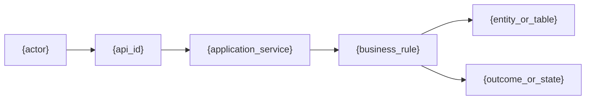

# {project_name} · {secondary_capability_name} 详细设计说明书

> 文档状态：评审中<br>
> 文档版本：{revision}<br>
> 所属能力：`{level1_capability_id}`<br>
> 二级能力标识：`{secondary_capability_id}`<br>
> 对应业务标识：`{business_ids}`<br>
> 证据基线：{source_commit}

> 设计完整性：`interface_design_status={detailed_or_not_applicable}` · `interface_coverage={complete_partial_or_not_applicable}` · `persistence_design_status={detailed_or_not_applicable}` · `relationship_model_status={relational_single_table_or_not_applicable}`

[返回能力总览](business/capabilities/{level1_capability_id}/detailed-design.md) · [上一个二级能力]({previous_secondary_document_path}) · [下一个二级能力]({next_secondary_document_path})

本文件保存 `{secondary_capability_name}` 的完整业务与代码设计。Dashboard 根据规范路径把它挂载到所属能力下；业务架构和能力总览只保留摘要、关系和链接，不复制本文件正文。

> **可追溯性约定**：已实现事实必须从业务流追溯至接口、代码对象、实体/表和测试；代码证据统一写为“`文件路径:起始行-结束行#符号`”。待开发设计写明“目标设计”，无法从仓库证实的内容写“缺失证据”，不得用类名或推测代替定位。

> **一级旅程同 ID 契约**：一级用户业务操作全景中的每个 `journey_id` 必须在所属二级文档中以完全相同的 `level1_journey_id` 出现，并绑定承接该操作的 `flow_id` 和/或 `api_id`；本文件也不得增加一级没有的旅程 ID。两层旅程集合双向一致，且一级为 `complete` 时本文件必须为 `interface_coverage=complete`。一级只保留 Controller/Handler、Service/UseCase、数据结果和用户可见结果摘要；本文件负责展开完整内部代码流、持久化与测试追溯。

## 1. 身份、职责与 business_id 映射

| 字段 | 内容 |
| --- | --- |
| `level1_capability_id` | `{level1_capability_id}` |
| `secondary_capability_id` | `{secondary_capability_id}` |
| 二级能力名称 | {secondary_capability_name} |
| `business_ids` | `{business_ids}` |
| `level1_journey_ids` | `{level1_journey_ids}` |
| 业务职责 | {responsibility} |
| 输入/触发 | {input_or_trigger} |
| 输出/完成条件 | {output_or_completion} |
| 非目标 | {non_goals} |

## 2. 参与者、权限与数据范围

| 参与者 | 前置条件 | 允许动作 | 数据范围 | 审计要求 | 证据 |
| --- | --- | --- | --- | --- | --- |
| {actor} | {precondition} | {action} | {data_scope} | {audit_rule} | {evidence_ref} |

## 3. 业务流与逻辑关系

每条关键链路分配稳定的 `{flow_id}`，并从一级全景带入同值 `{level1_journey_id}`。图中的节点与下表、接口和代码对象使用相同标识，便于横向追溯。一个内部流承接多个一级旅程时，为每个 `level1_journey_id` 分别保留绑定行，不得用无法机检的合并文本代替。



| `level1_journey_id` | `flow_id` / 步骤 | 发起方 | 业务动作与决策规则 | 输入 | 代码对象 | 读/写实体或表 | 输出/状态变化 | 失败与恢复 | 证据 |
| --- | --- | --- | --- | --- | --- | --- | --- | --- | --- |
| `{level1_journey_id}` | `{flow_id}` / {step} | {actor} | {action_and_decision} | {input} | {code_object_refs} | {entity_table_refs} | {result} | {failure_recovery} | {evidence_ref} |

## 4. 业务对象、状态与规则

| 对象/规则 | 权威来源 | 当前状态/条件 | 触发 | 下一状态/决策 | 约束 | 证据 |
| --- | --- | --- | --- | --- | --- | --- |
| {object_or_rule} | {source_of_truth} | {condition} | {trigger} | {result} | {constraint} | {evidence_ref} |

## 5. 接口详细设计

HTTP 接口、事件/主题、定时任务和内部命令均是可追溯契约。`interface_design_status=detailed` 时，每个契约必须拥有一个直接位于本章下的独立 `### 5.N {接口/事件/任务/命令名称}` 分组；组内固定使用同一编号前缀的 `5.N.1` 至 `5.N.5`，不得把多个契约压平到一张横向宽表，也不得把请求、响应或错误字段提取为全章共用小节。第二个契约必须使用 `5.2.1` 至 `5.2.5`，后续依次递增。

每个分组列出具体 HTTP 方法与完整路径、EVENT/TOPIC 主题、JOB 调度入口或 COMMAND 名称，字段级输入输出、错误映射以及入口到测试的代码链；不得用“现有入口集合”“对应应用服务”或仅列类名代替。`interface_coverage=partial` 时必须记录稳定的 `interface_gap_id`，并说明未覆盖入口及影响。

只有仓库证据能证明本能力不存在任何可调用入口、事件、主题、任务或命令时，才可使用 `interface_design_status=not_applicable` 与 `interface_coverage=not_applicable`。此时不保留空分组，改为填写 `interface_not_applicable_reason={reason}` 和 `interface_not_applicable_evidence={file_path_line_symbol}`；证据必须是仓库相对的 `path:begin-end#symbol`，不能只写“无接口”。

### 5.1 {interface_event_job_or_command_name}

#### 5.1.1 接口清单与代码追溯

| 项目 | 内容 |
| --- | --- |
| `level1_journey_id` | `{level1_journey_id}` |
| `api_id` | `{api_id}` |
| 契约类型 | HTTP / EVENT / TOPIC / JOB / COMMAND |
| 方法与完整路径或主题 | `{method_and_path_or_event_topic_job_command}` |
| 业务目的 | {business_purpose} |
| 调用方 | {caller} |
| 请求模型 | `{request_type}` |
| 响应模型 | `{response_type}` / `not_applicable`（原因与证据） |
| 状态 | 已实现 / 目标设计 / 缺失证据 |

| 实现层 | 精确定位 | 职责 |
| --- | --- | --- |
| Controller/入口 | `{controller_file_line_symbol}` | {entry_responsibility} |
| Service/用例 | `{service_file_line_symbol}` | {use_case_responsibility} |
| Mapper/Repository | `{mapper_file_line_symbol}` | {persistence_responsibility} |
| 实体/表 | `{entity_file_line_symbol}`；表 `{table_name}` | {entity_table_responsibility} |
| 测试 | `{test_file_line_symbol}` | {test_responsibility} |

#### 5.1.2 请求字段

本小节只描述 5.1 这一项契约。HTTP 逐项列出 Header、Path、Query 与 Body；EVENT/TOPIC 列出消息头、键与载荷；JOB/COMMAND 列出调度上下文、参数和触发条件。确实没有字段时保留一行 `not_applicable`，同时写出原因和精确证据，不得留空。

| 字段 | 位置 | 类型 | 必填 | 约束/枚举 | 业务语义 | 敏感处理 | 证据/状态 |
| --- | --- | --- | --- | --- | --- | --- | --- |
| `{field_name}` | Header / Path / Query / Body / MessageHeader / Key / Payload / Context | `{field_type}` | 是 / 否 | {validation_or_enum} | {business_semantics} | {sensitivity_control} | {evidence_or_target} |

#### 5.1.3 响应字段

HTTP 列出状态码与响应体；EVENT/TOPIC 列出确认、结果事件或明确的单向语义；JOB/COMMAND 列出执行结果与状态。没有直接响应时使用带原因和证据的 `not_applicable` 行。

| HTTP/消息/执行状态 | 字段 | 类型 | 可空 | 业务语义 | 产生位置 | 证据/状态 |
| --- | --- | --- | --- | --- | --- | --- |
| `{status}` | `{field_name}` | `{field_type}` | 是 / 否 | {business_semantics} | {producer} | {evidence_or_target} |

#### 5.1.4 错误码与异常映射

| HTTP/错误码/失败状态 | 触发条件 | 用户或调用方可见语义 | 重试/回滚/补偿 | 代码证据/状态 |
| --- | --- | --- | --- | --- |
| `{http_error_or_failure_status}` | {trigger_condition} | {visible_semantics} | {recovery_behavior} | {evidence_or_target} |

#### 5.1.5 认证、授权、幂等与事务

| 维度 | 设计 | 证据 |
| --- | --- | --- |
| 认证 | {authentication_design} | {evidence_or_target} |
| 授权 | {authorization_design} | {evidence_or_target} |
| 幂等 | {idempotency_design} | {evidence_or_target} |
| 事务/一致性 | {transaction_consistency_design} | {evidence_or_target} |
| 超时/重试/补偿 | {timeout_retry_compensation_design} | {evidence_or_target} |

若存在第二项契约，复制完整分组并严格使用以下标题；不得只复制清单或沿用 `5.1.x` 编号：

- `### 5.2 {next_interface_event_job_or_command_name}`；
- `#### 5.2.1 接口清单与代码追溯`；
- `#### 5.2.2 请求字段`；
- `#### 5.2.3 响应字段`；
- `#### 5.2.4 错误码与异常映射`；
- `#### 5.2.5 认证、授权、幂等与事务`。

第三项及后续契约同样使用 `5.3.1` 至 `5.3.5`、`5.4.1` 至 `5.4.5` 依次递增。每个分组中的 `level1_journey_id` 与 `api_id`、字段、错误和代码定位只属于该分组，不能引用另一接口的全局字段表代替。

## 6. 代码对象与关系

列出承担本能力的入口、应用服务、领域对象、DTO/命令、实体、Mapper/Repository、事件、缓存和任务。每一条依赖均引用实际代码位置，不能只罗列类名。

```mermaid
classDiagram
    class {controller_symbol} {
      +{entry_method}()
    }
    class {application_service_symbol} {
      +{use_case_method}()
    }
    class {repository_symbol}
    class {entity_symbol}
    {controller_symbol} --> {application_service_symbol} : invokes
    {application_service_symbol} --> {repository_symbol} : reads/writes
    {repository_symbol} --> {entity_symbol} : maps
```

图中的节点必须替换为仓库中的实际符号或已批准的目标符号，不能保留 `Controller`、`ApplicationService`、`Repository`、`Entity` 等泛化节点名。

| 对象标识 | 类型 | 职责 | 输入/输出 | 依赖或被依赖关系 | 对应实体/表 | 源码定位 | 状态 |
| --- | --- | --- | --- | --- | --- | --- | --- |
| `{code_object}` | Controller / Service / DTO / Entity / Mapper / Event / Cache | {responsibility} | {input_output} | `{relation_type}` → `{related_object}` | {entity_table_refs} | `{file_path_line_symbol}` | 已实现 / 目标设计 / 缺失证据 |

## 7. 实体、表与对象关系

本节先说明业务实体、物理表和代码对象的关系，再展开字段与索引。`persistence_design_status=detailed` 时关系图必填，图中表名必须与 8.1 数据表清单一致。多表使用 `relationship_model_status=relational`，单表使用 `relationship_model_status=single_table` 并展示该表实体块。禁止使用 `BUSINESS_FLOW`、`API`、`RESULT`、`TABLE`、`ENTITY_A` 或 `ENTITY_B` 作为 ER 实体。

每条边必须写出两端关联字段、基数、关系类型和证据。数据库存在真实外键约束时标为 `physical_fk`；仅由字段、Mapper、查询或业务规则维持时标为 `logical_relation`；跨系统引用标为 `external_reference`，不得把逻辑关系写成物理外键。

```mermaid
erDiagram
    {source_table} ||--o{ {target_table} : "{source_key} = {target_key}; {relationship_type}"
```

| 来源实体/表 | 关系 | 目标实体/表 | 基数 | 关联字段/业务键 | Java/代码对象 | 关系类型 | 数据所有者 | 证据/状态 |
| --- | --- | --- | --- | --- | --- | --- | --- | --- |
| `{source_table}` | 拥有 / 引用 / 关联 / 审计 | `{target_table}` | 1:1 / 1:N / N:M | `{source_table}.{source_key} = {target_table}.{target_key}` | `{code_object_ref}` | `physical_fk` / `logical_relation` / `external_reference` | {data_owner} | {evidence_or_target} |

## 8. 表结构设计

本节必须把业务对象、状态和规则落实到可实现、可审查的表结构。已实现功能引用实体、迁移脚本和真实结构；待开发功能标记为目标设计，不得把建议字段写成现状。

### 8.1 数据表清单

| 表名 | 中文名称 | 表类型 | 业务用途 | 权威写入方 | 主要读取方 | 生命周期 | 代码/迁移证据 |
| --- | --- | --- | --- | --- | --- | --- | --- |
| `{table_name}` | {table_display_name} | 主数据 / 交易 / 明细 / 关系 / 日志 | {business_purpose} | {write_owner} | {readers} | {lifecycle} | {entity_or_migration_ref} |

共享表必须指定唯一权威写入方。只读复用、跨能力查询、冗余副本和同步方式分别说明。

### 8.2 实体-表-代码映射

| 业务实体 | Java 实体/DTO | Mapper/Repository | 映射文件或迁移 | 物理表 | 主键/关联键 | 读写入口 | 证据/状态 |
| --- | --- | --- | --- | --- | --- | --- | --- |
| `{business_entity}` | `{java_entity_or_dto}` | `{mapper_or_repository}` | `{mapping_or_migration_file}` | `{table_name}` | `{keys}` | `{api_or_service_ref}` | {evidence_or_target} |

### 8.3 表定义与字段结构

为数据表清单中的每张表重复本小节。

#### 表：`{table_name}`

| 字段名 | 数据类型 | 可空 | 默认值 | 主键/业务键 | 业务含义 | 校验与取值范围 | 敏感/加密 | 对应对象属性 | 证据/状态 |
| --- | --- | --- | --- | --- | --- | --- | --- | --- | --- |
| `{column_name}` | `{data_type}` | 是 / 否 | `{default_value}` | PK / UK / FK / 普通 | {business_meaning} | {validation_or_enum} | {sensitivity_control} | `{object_property}` | {evidence_or_target} |

字段设计至少说明主键策略、隔离字段、业务唯一标识、状态、金额精度、时间语义、逻辑删除、乐观锁、审计字段和敏感信息处理；不适用项写明原因。

### 8.4 索引与约束

| 表名 | 索引/约束名 | 类型 | 字段及顺序 | 唯一性 | 支撑的查询或业务规则 | 选择性/规模依据 | 写入代价 | 证据/状态 |
| --- | --- | --- | --- | --- | --- | --- | --- | --- |
| `{table_name}` | `{index_or_constraint_name}` | PK / UK / INDEX / FK / CHECK | `{columns}` | 是 / 否 | {query_or_rule} | {cardinality_evidence} | {write_tradeoff} | {evidence_or_target} |

### 8.5 表关系与数据所有权

| 来源表 | 关系 | 目标表 | 关联字段 | 基数 | 关系类型 | 级联/删除策略 | 权威所有者 | 跨库/跨服务处理 | 证据/状态 |
| --- | --- | --- | --- | --- | --- | --- | --- | --- | --- |
| `{source_table}` | 关联 / 聚合 / 引用 / 冗余 | `{target_table}` | `{source_table}.{source_key} = {target_table}.{target_key}` | 1:1 / 1:N / N:M | `physical_fk` / `logical_relation` / `external_reference` | {cascade_or_retention} | {data_owner} | {cross_boundary_strategy} | {evidence_or_target} |

物理外键、逻辑外键和跨服务引用必须区分。跨服务数据不得用共享写表代替 API、事件或同步契约。

### 8.6 状态与字段映射

| 业务对象/状态 | 表名 | 字段 | 数据库存值 | 进入条件 | 允许迁移 | 禁止迁移 | 写入入口 | 证据/状态 |
| --- | --- | --- | --- | --- | --- | --- | --- | --- |
| {business_object_state} | `{table_name}` | `{status_column}` | `{stored_value}` | {entry_condition} | {allowed_transitions} | {forbidden_transitions} | {write_entrypoint} | {evidence_or_target} |

本表必须与第 4 章一致，用来检查代码枚举、数据库值、迁移脚本和用户可见状态是否采用同一语义。

### 8.7 读写路径与一致性

| 场景 | 读表/索引 | 写表 | 事务边界 | 幂等键/唯一约束 | 锁或并发策略 | 缓存/搜索同步 | 失败与补偿 |
| --- | --- | --- | --- | --- | --- | --- | --- |
| {scenario} | `{read_tables_and_indexes}` | `{write_tables}` | {transaction_boundary} | {idempotency_guard} | {concurrency_control} | {cache_search_consistency} | {failure_compensation} |

### 8.8 数据迁移、兼容与回滚

| 变更 | 当前结构 | 目标结构 | 数据回填/清洗 | 双写/兼容窗口 | 校验方式 | 发布顺序 | 回滚方案 | 风险与阻断条件 |
| --- | --- | --- | --- | --- | --- | --- | --- | --- |
| {schema_change} | {current_schema} | {target_schema} | {backfill_plan} | {compatibility_window} | {verification} | {release_order} | {rollback_plan} | {risk_and_stop_condition} |

如果没有数据库变更，明确记录“无表结构变化”及证据。涉及 DDL 时引用迁移文件或评审后的目标 DDL，不在证据不足时编造可执行 SQL。

## 9. 事务、并发、性能与容错

说明事务边界、唯一性、幂等、并发、异步一致性、超时、重试、补偿、容量假设、性能目标、降级和可观测信号。

## 10. 安全、测试与验收

| 需求/规则 | 安全/权限控制 | 测试点 | 可观察验收结果 | 证据/计划 |
| --- | --- | --- | --- | --- |
| {requirement} | {control} | {test_point} | {acceptance_result} | {evidence_or_plan} |

## 11. 端到端追溯矩阵

每个一级 `level1_journey_id` 至少绑定一个 `flow_id` 和/或 `api_id`，并覆盖一条业务流 → 接口/入口 → Controller → Service → Mapper/Repository → 实体/表 → 测试的链路。`level1_journey_id` 必须与一级全景中的 `journey_id` 完全相同。某一内部跳不存在或无法定位时，保留该行并标注“缺失证据”。

| `level1_journey_id` | `flow_id` | 业务规则/状态 | `api_id` / 入口 | Controller | Service | Mapper/Repository | 实体/表 | 测试 | 证据完整性 |
| --- | --- | --- | --- | --- | --- | --- | --- | --- | --- |
| `{level1_journey_id}` | `{flow_id}` | {business_rule} | `{api_id}` / {entrypoint} | `{controller_file_line_symbol}` | `{service_file_line_symbol}` | `{mapper_file_line_symbol}` | {entity_table_refs} | `{test_file_line_symbol}` | 已验证 / 部分缺失 / 目标设计 |

## 12. 风险、假设与缺失证据

| 类型 | 内容 | 影响 | 已检查范围 | 需要确认的角色/证据 | 阻断级别 |
| --- | --- | --- | --- | --- | --- |
| {risk_assumption_missing} | {description} | {impact} | {searched_scope} | {confirmation_needed} | {blocking_level} |

## 13. 文档导航与证据索引

- 返回能力总览：`business/capabilities/{level1_capability_id}/detailed-design.md`；
- 上一个二级能力：`{previous_secondary_document_path}`；
- 下一个二级能力：`{next_secondary_document_path}`；
- 相关需求、功能、API、数据库、测试和部署文档：{related_document_paths}；
- 证据按 routes、controllers、pages、menus、services、entities、mappers、migrations、tests、config 和 docs 分类列出，并使用 `文件路径:起始行-结束行#符号` 格式；
- 每个 `level1_journey_id`、`flow_id`、`api_id`、代码对象、实体和数据表都应能在本节找到至少一个已验证定位或明确的内部缺失证据；每个 `level1_journey_id` 都能反向定位一级全景中的同值 `journey_id`。
