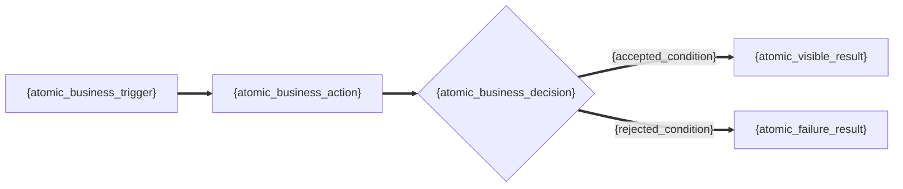
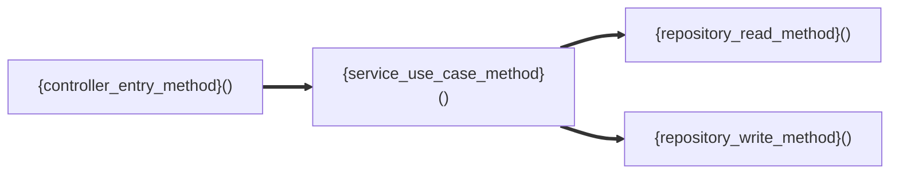

# {project_name} · {secondary_capability_name} 详细设计说明书

<!-- axis-template-use
默认生成 reader_profile=compact，只保留下面 1-6 六个读者章节。实际输出必须替换所有花括号内容，删除不适用的示例行与未采用的图；不得把模板变量、示例证据或可选 strict_full 说明留在成品中。
只有证据完整且读者明确需要逐接口审计时，才使用文末 axis-strict-full-profile 扩展，并把下方 metadata 改为 reader_profile=strict_full；不得用 compact 标识承载完整展开。strict_full 不是默认展示方式。
-->

<!-- axis-document-metadata
reader_profile=compact
document_status=review
revision={revision}
level1_capability_id={level1_capability_id}
secondary_capability_id={secondary_capability_id}
business_ids={business_ids}
source_commit={source_commit}
interface_design_status={detailed_or_not_applicable}
interface_coverage={complete_partial_or_not_applicable}
interface_gap_id={gap_id_or_not_applicable}
-->

[返回能力总览](business/capabilities/{level1_capability_id}/detailed-design.md) · [上一个二级能力]({previous_secondary_document_path}) · [下一个二级能力]({next_secondary_document_path})

本文件只说明一个可独立评审的业务结果，源码定位统一显示 `文件名:起始行-结束行#符号`。

## 1. 能力定位与边界

| 项目 | 内容 |
| --- | --- |
| 负责的业务结果 | {independently_reviewable_business_outcome} |
| 用户可见结果 | {user_visible_result} |
| 纳入范围 | {included_scope} |
| 不包含 | {non_goals} |
| 证据 | `{evidence_file_name}:{begin_line}-{end_line}#{symbol}` |

<!-- axis-evidence: {boundary_evidence_path_begin_end_symbol} -->
<!-- axis-boundary-machine-table
| 字段 | 内容 |
| --- | --- |
| `level1_capability_id` | `{level1_capability_id}` |
| `secondary_capability_id` | `{secondary_capability_id}` |
| `business_ids` | `{business_ids}` |
| 负责的业务结果 | {independently_reviewable_business_outcome} |
| 纳入范围 | {included_scope} |
| 不包含 | {non_goals} |
| 证据 | `{boundary_evidence_path_begin_end_symbol}` |
-->

## 2. 调用主体、权限与接口矩阵

| 主体/角色 | 所需权限/策略 | 可调用接口/能力 | 数据范围 |
| --- | --- | --- | --- |
| {concrete_actor_or_role} | {permission_code_authentication_or_policy} | `{method_and_path_or_event_topic_job_command}` | {tenant_organization_resource_or_public_scope} |

<!-- axis-evidence: {authorization_or_scope_evidence} -->
<!-- axis-access-matrix-machine-table
| 主体/角色 | 所需权限/策略 | `api_id` | 可调用接口/能力 | 数据范围 | 授权证据 |
| --- | --- | --- | --- | --- | --- |
| {concrete_actor_or_role} | {permission_code_authentication_or_policy} | `{api_id}` | `{method_and_path_or_event_topic_job_command}` | {tenant_organization_resource_or_public_scope} | `{authorization_or_scope_evidence}` |
-->

<!-- axis-authoring-contract
一行只表达一个主体与一个入口的授权关系。权限填写真实权限码、authenticated、public、可信内部边界或有证据的资源归属规则；不得写“执行已授权流程”等泛化结论。证据不足时写入第 6 章缺口，不推断角色或数据范围。
-->

## 3. 能力流程

| 项目 | 内容 |
| --- | --- |
| 入口/触发 | {business_trigger} |
| 主流程 | {short_business_flow_summary} |
| 用户可见结果 | {user_visible_result} |
| 失败与补偿 | {failure_and_compensation} |
| 证据 | `{evidence_file_name}:{begin_line}-{end_line}#{symbol}` |

<!-- axis-evidence: {flow_evidence_path_begin_end_symbol} -->
<!-- axis-capability-flow-machine-table
| 项目 | 内容 |
| --- | --- |
| `level1_journey_id` | `{level1_journey_id}` |
| `flow_id` | `{flow_id}` |
| 参与 `api_id` | `{participating_api_ids}` |
| 上游契约/触发 | `{upstream_api_event_job_or_command}` |
| 下游契约/结果 | `{downstream_api_event_job_or_command_or_result}` |
| 状态传递 | {cross_contract_rule_or_state_handoff} |
| 失败与补偿 | {failure_and_compensation} |
| 证据 | `{flow_evidence_path_begin_end_symbol}` |
-->

<!-- axis-authoring-contract
本章是业务视角，一张图只表达业务动作、判断、状态或可见结果；每个节点只放一个最小业务单元，不出现类名、方法名、表名或多个动作的并列描述。没有分支或图不能提升理解时，删除图，只保留短表。
-->

## 4. 对象与规则

| 业务对象/规则 | 权威含义 | 状态/条件 | 约束或结果 | 证据 |
| --- | --- | --- | --- | --- |
| {business_object_or_rule} | {authoritative_business_meaning} | {state_or_condition} | {constraint_or_result} | `{evidence_file_name}:{begin_line}-{end_line}#{symbol}` |

<!-- axis-evidence: {object_or_rule_evidence_path_begin_end_symbol} -->
<!-- axis-object-rule-machine-table
| 字段 | 内容 |
| --- | --- |
| `rule_id` | `{rule_id}` |
| 权威来源 | {source_of_truth} |
| 触发 | {trigger} |
| 当前状态/条件 | {state_or_condition} |
| 下一状态/决策 | {constraint_or_result} |
| 证据 | `{object_or_rule_evidence_path_begin_end_symbol}` |
-->

## 5. 接口摘要

### 5.1 {interface_event_job_or_command_name}

| 项目 | 内容 |
| --- | --- |
| 入口 | `{method_and_path_or_event_topic_job_command}` |
| 业务目的 | {business_purpose} |
| 调用方 | {caller} |
| 核心业务输入 | {business_relevant_input_summary_or_not_applicable} |
| 用户/调用方可见结果 | {business_relevant_output_summary_or_one_way_semantics} |
| 失败语义 | {business_failure_semantics} |
| 数据影响 | {business_data_effect_or_no_persistence} |
| 方法定位 | `{controller_file_name}:{begin_line}-{end_line}#{entry_method}` → `{service_file_name}:{begin_line}-{end_line}#{use_case_method}` |
| 验收 | {observable_acceptance_summary} |

<!-- axis-evidence: {controller_file_line_symbol} -->
<!-- axis-evidence: {service_file_line_symbol} -->
<!-- axis-evidence: {mapper_file_line_symbol_or_not_applicable_evidence} -->
<!-- axis-evidence: {entity_file_line_symbol_or_not_applicable_evidence} -->
<!-- axis-evidence: {test_file_line_symbol} -->
<!-- axis-interface-machine-table
| 项目 | 内容 |
| --- | --- |
| `level1_journey_id` | `{level1_journey_id}` |
| `flow_id` | `{flow_id}` |
| `api_id` | `{api_id}` |
| 契约类型 | HTTP / EVENT / TOPIC / JOB / COMMAND |
| 方法与完整路径或主题 | `{method_and_path_or_event_topic_job_command}` |
| 请求模型 | `{request_type}` |
| 响应模型 | `{response_type_or_not_applicable}` |
| parent `table_id` | `{parent_table_ids_or_not_applicable}` |
| 物理表 | `{physical_table_names_or_not_applicable}` |
| 状态 | 已实现 / 目标设计 / 缺失证据 |
-->
<!-- axis-implementation-machine-table
| 实现层 | 精确定位 | 职责 |
| --- | --- | --- |
| Controller/入口 | `{controller_file_line_symbol}` | {entry_responsibility} |
| Service/用例 | `{service_file_line_symbol}` | {use_case_responsibility} |
| Mapper/Repository | `{mapper_file_line_symbol_or_not_applicable_evidence}` | {persistence_responsibility_or_no_persistence} |
| 实体/表 | `{entity_file_line_symbol_or_not_applicable_evidence}`；`table_id={parent_table_ids_or_not_applicable}`；物理表 `{physical_table_names_or_not_applicable}` | {entity_table_responsibility_or_no_persistence_reason} |
| 测试 | `{test_file_line_symbol}` | {test_responsibility} |
-->

<!-- axis-authoring-contract
接口摘要只列影响业务决策、权限或数据范围、状态、金额/数量/时间、敏感处理、可见结果或失败语义的字段。通用响应包裹、分页样板、链路字段和基础设施 DTO 字段只保留模型名，不逐字段展示。

方法图仅在调用关系需要澄清时使用；同一张图只选择一种视角：业务或方法。这里若使用方法图，每个方法节点只写一个具体方法调用，业务含义、输入、结果、异常和数据变化写在边或表格，不把方法名与动作说明混在节点中。
-->

<!-- axis-authoring-contract
每个真实 HTTP / EVENT / TOPIC / JOB / COMMAND 契约复制一个连续的 5.N 接口摘要；无证据的入口进入缺口，不生成空摘要。仅当精确证据证明本能力没有任何契约时，机器元数据使用 interface_not_applicable_reason 与 interface_not_applicable_evidence。
-->

## 6. 缺口

| 类型 | 缺口 | 影响 | 下一步 | 状态 |
| --- | --- | --- | --- | --- |
| {missing_evidence_assumption_or_risk} | {gap_description} | {business_or_design_impact} | {required_evidence_or_decision} | {gap_status} |

<!-- axis-gap-machine-table
| 字段 | 内容 |
| --- | --- |
| `interface_gap_id` | `{gap_id_or_not_applicable}` |
| `interface_coverage` | `{complete_partial_or_not_applicable}` |
| 已检查范围 | {searched_scope} |
| 责任角色 | {owner_role} |
| 阻断级别 | {blocking_level} |
| 完整证据 | `{gap_evidence_path_begin_end_symbol_or_not_applicable}` |
-->

<!-- axis-strict-full-profile
以下仅定义可选 strict_full 展开契约，不是 compact 默认读者章节。只有 interface_coverage=complete、逐项证据齐全且读者明确要求审计级详情时，才把每个接口展开为 5.N.1 至 5.N.8，并把 metadata 切换为 reader_profile=strict_full；否则保持上面的接口摘要。生成成品时删除本说明块。

兼容名称：能力级流程与跨接口关系；本章只描述二级能力内部多个接口的编排；接口内部逻辑见各 `5.N.2`。
## 3. 能力级流程与跨接口关系
## 5. 接口详细设计
#### 5.1.1 接口清单与代码追溯
| 项目 | 内容 |
| 实现层 | 精确定位 | 职责 |
| 实体/表 | `{entity_file_line_symbol_or_not_applicable_evidence}`；`table_id={parent_table_ids_or_not_applicable}`；物理表 `{physical_table_names_or_not_applicable}` | {entity_table_responsibility_or_no_persistence_reason} |
#### 5.1.2 内部处理逻辑
处理说明：{concrete_internal_processing_summary}
| 步骤 | 方法 | 业务作用 | 数据/状态变化 | 失败处理 |
#### 5.1.3 请求字段
| 字段 | 位置 | 类型/必填 | 约束/枚举 | 业务语义/敏感处理 | 证据/状态 |
#### 5.1.4 响应字段
| HTTP/消息/执行状态 | 字段 | 类型/可空 | 业务语义/产生位置 | 证据/状态 |
#### 5.1.5 错误码与异常映射
#### 5.1.6 认证与授权执行
#### 5.1.7 事务、并发、性能与容错
#### 5.1.8 安全、测试与验收
### 5.2 {next_interface_event_job_or_command_name}
#### 5.2.1 接口清单与代码追溯
#### 5.2.2 内部处理逻辑
#### 5.2.3 请求字段
#### 5.2.4 响应字段
#### 5.2.5 错误码与异常映射
#### 5.2.6 认证与授权执行
#### 5.2.7 事务、并发、性能与容错
#### 5.2.8 安全、测试与验收

strict_full 仍只展示业务相关字段；每个方法节点只写一个具体方法调用；完整路径、ID、coverage、授权证据、table_id、源码关系与验收追溯继续放在机器注释中。interface_not_applicable_reason 与 interface_not_applicable_evidence 仅用于精确证据证明无契约的分支。
-->
