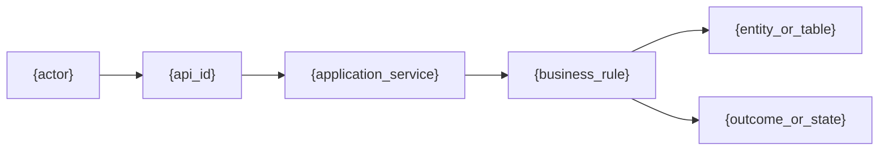
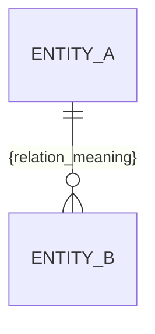

# {project_name} · {secondary_capability_name} 详细设计说明书

> 文档状态：评审中<br>
> 文档版本：{revision}<br>
> 所属能力：`{level1_capability_id}`<br>
> 二级能力标识：`{secondary_capability_id}`<br>
> 对应业务标识：`{business_ids}`<br>
> 证据基线：{source_commit}

[返回能力总览](business/capabilities/{level1_capability_id}/detailed-design.md) · [上一个二级能力]({previous_secondary_document_path}) · [下一个二级能力]({next_secondary_document_path})

本文件保存 `{secondary_capability_name}` 的完整业务与代码设计。Dashboard 根据规范路径把它挂载到所属能力下；业务架构和能力总览只保留摘要、关系和链接，不复制本文件正文。

> **可追溯性约定**：已实现事实必须从业务流追溯至接口、代码对象、实体/表和测试；代码证据统一写为“`文件路径:起始行-结束行#符号`”。待开发设计写明“目标设计”，无法从仓库证实的内容写“缺失证据”，不得用类名或推测代替定位。

## 1. 身份、职责与 business_id 映射

| 字段 | 内容 |
| --- | --- |
| `level1_capability_id` | `{level1_capability_id}` |
| `secondary_capability_id` | `{secondary_capability_id}` |
| 二级能力名称 | {secondary_capability_name} |
| `business_ids` | `{business_ids}` |
| 业务职责 | {responsibility} |
| 输入/触发 | {input_or_trigger} |
| 输出/完成条件 | {output_or_completion} |
| 非目标 | {non_goals} |

## 2. 参与者、权限与数据范围

| 参与者 | 前置条件 | 允许动作 | 数据范围 | 审计要求 | 证据 |
| --- | --- | --- | --- | --- | --- |
| {actor} | {precondition} | {action} | {data_scope} | {audit_rule} | {evidence_ref} |

## 3. 业务流与逻辑关系

每条关键链路分配稳定的 `{flow_id}`，并给出流程图。图中的节点与下表、接口和代码对象使用相同标识，便于横向追溯。



| `flow_id` / 步骤 | 发起方 | 业务动作与决策规则 | 输入 | 代码对象 | 读/写实体或表 | 输出/状态变化 | 失败与恢复 | 证据 |
| --- | --- | --- | --- | --- | --- | --- | --- | --- |
| `{flow_id}` / {step} | {actor} | {action_and_decision} | {input} | {code_object_refs} | {entity_table_refs} | {result} | {failure_recovery} | {evidence_ref} |

## 4. 业务对象、状态与规则

| 对象/规则 | 权威来源 | 当前状态/条件 | 触发 | 下一状态/决策 | 约束 | 证据 |
| --- | --- | --- | --- | --- | --- | --- |
| {object_or_rule} | {source_of_truth} | {condition} | {trigger} | {result} | {constraint} | {evidence_ref} |

## 5. 接口到代码追踪

HTTP 接口、消息、定时任务和内部命令均需列出。已实现接口必须精确到 Controller、Service、Mapper/Repository 的文件和行号；没有对应实现时标记“目标设计”或“缺失证据”。

| `api_id` / 契约 | 调用方 | 传输与路径 | 输入/输出语义 | Controller/入口定位 | Service/用例定位 | Mapper/Repository 定位 | 实体/表 | 测试定位 | 状态 |
| --- | --- | --- | --- | --- | --- | --- | --- | --- | --- |
| `{api_id}` | {caller} | `{method} {path_or_topic}` | {request_response_semantics} | `{controller_file_line_symbol}` | `{service_file_line_symbol}` | `{mapper_file_line_symbol}` | {entity_table_refs} | `{test_file_line_symbol}` | 已实现 / 目标设计 / 缺失证据 |

## 6. 代码对象与关系

列出承担本能力的入口、应用服务、领域对象、DTO/命令、实体、Mapper/Repository、事件、缓存和任务。每一条依赖均引用实际代码位置，不能只罗列类名。

```mermaid
classDiagram
    class Controller {
      +{entry_method}()
    }
    class ApplicationService {
      +{use_case_method}()
    }
    class Entity
    class Repository
    Controller --> ApplicationService : invokes
    ApplicationService --> Repository : reads/writes
    Repository --> Entity : maps
```

| 对象标识 | 类型 | 职责 | 输入/输出 | 依赖或被依赖关系 | 对应实体/表 | 源码定位 | 状态 |
| --- | --- | --- | --- | --- | --- | --- | --- |
| `{code_object}` | Controller / Service / DTO / Entity / Mapper / Event / Cache | {responsibility} | {input_output} | `{relation_type}` → `{related_object}` | {entity_table_refs} | `{file_path_line_symbol}` | 已实现 / 目标设计 / 缺失证据 |

## 7. 实体、表与对象关系

本节先说明业务实体、物理表和代码对象的关系，再展开字段与索引。实体关系图应覆盖主实体、关系表、审计/日志表和跨服务引用；物理外键、逻辑外键、对象聚合分别标注。



| 业务实体 | 关系 | 目标实体 | 基数 | 关联字段/业务键 | Java/代码对象 | 物理表 | 关系实现 | 证据/状态 |
| --- | --- | --- | --- | --- | --- | --- | --- | --- |
| `{source_entity}` | 拥有 / 引用 / 关联 / 审计 | `{target_entity}` | 1:1 / 1:N / N:M | `{join_or_business_key}` | `{code_object_ref}` | `{table_name}` | 物理 FK / 逻辑关联 / 事件 / API | {evidence_or_target} |

## 8. 表结构设计

本节必须把业务对象、状态和规则落实到可实现、可审查的表结构。已实现功能引用实体、迁移脚本和真实结构；待开发功能标记为目标设计，不得把建议字段写成现状。

### 8.1 数据表清单

| 表名 | 中文名称 | 表类型 | 业务用途 | 权威写入方 | 主要读取方 | 生命周期 | 代码/迁移证据 |
| --- | --- | --- | --- | --- | --- | --- | --- |
| `{table_name}` | {table_display_name} | 主数据 / 交易 / 明细 / 关系 / 日志 | {business_purpose} | {write_owner} | {readers} | {lifecycle} | {entity_or_migration_ref} |

共享表必须指定唯一权威写入方。只读复用、跨能力查询、冗余副本和同步方式分别说明。

### 8.2 实体-表-代码映射

| 业务实体 | Java 实体/DTO | Mapper/Repository | 映射文件或迁移 | 物理表 | 主键/关联键 | 读写入口 | 证据/状态 |
| --- | --- | --- | --- | --- | --- | --- | --- |
| `{business_entity}` | `{java_entity_or_dto}` | `{mapper_or_repository}` | `{mapping_or_migration_file}` | `{table_name}` | `{keys}` | `{api_or_service_ref}` | {evidence_or_target} |

### 8.3 表定义与字段结构

为数据表清单中的每张表重复本小节。

#### 表：`{table_name}`

| 字段名 | 数据类型 | 可空 | 默认值 | 主键/业务键 | 业务含义 | 校验与取值范围 | 敏感/加密 | 对应对象属性 | 证据/状态 |
| --- | --- | --- | --- | --- | --- | --- | --- | --- | --- |
| `{column_name}` | `{data_type}` | 是 / 否 | `{default_value}` | PK / UK / FK / 普通 | {business_meaning} | {validation_or_enum} | {sensitivity_control} | `{object_property}` | {evidence_or_target} |

字段设计至少说明主键策略、隔离字段、业务唯一标识、状态、金额精度、时间语义、逻辑删除、乐观锁、审计字段和敏感信息处理；不适用项写明原因。

### 8.4 索引与约束

| 表名 | 索引/约束名 | 类型 | 字段及顺序 | 唯一性 | 支撑的查询或业务规则 | 选择性/规模依据 | 写入代价 | 证据/状态 |
| --- | --- | --- | --- | --- | --- | --- | --- | --- |
| `{table_name}` | `{index_or_constraint_name}` | PK / UK / INDEX / FK / CHECK | `{columns}` | 是 / 否 | {query_or_rule} | {cardinality_evidence} | {write_tradeoff} | {evidence_or_target} |

### 8.5 表关系与数据所有权

| 来源表 | 关系 | 目标表 | 关联字段 | 基数 | 级联/删除策略 | 权威所有者 | 跨库/跨服务处理 | 证据/状态 |
| --- | --- | --- | --- | --- | --- | --- | --- | --- |
| `{source_table}` | 关联 / 聚合 / 引用 / 冗余 | `{target_table}` | `{join_columns}` | 1:1 / 1:N / N:M | {cascade_or_retention} | {data_owner} | {cross_boundary_strategy} | {evidence_or_target} |

物理外键、逻辑外键和跨服务引用必须区分。跨服务数据不得用共享写表代替 API、事件或同步契约。

### 8.6 状态与字段映射

| 业务对象/状态 | 表名 | 字段 | 数据库存值 | 进入条件 | 允许迁移 | 禁止迁移 | 写入入口 | 证据/状态 |
| --- | --- | --- | --- | --- | --- | --- | --- | --- |
| {business_object_state} | `{table_name}` | `{status_column}` | `{stored_value}` | {entry_condition} | {allowed_transitions} | {forbidden_transitions} | {write_entrypoint} | {evidence_or_target} |

本表必须与第 4 章一致，用来检查代码枚举、数据库值、迁移脚本和用户可见状态是否采用同一语义。

### 8.7 读写路径与一致性

| 场景 | 读表/索引 | 写表 | 事务边界 | 幂等键/唯一约束 | 锁或并发策略 | 缓存/搜索同步 | 失败与补偿 |
| --- | --- | --- | --- | --- | --- | --- | --- |
| {scenario} | `{read_tables_and_indexes}` | `{write_tables}` | {transaction_boundary} | {idempotency_guard} | {concurrency_control} | {cache_search_consistency} | {failure_compensation} |

### 8.8 数据迁移、兼容与回滚

| 变更 | 当前结构 | 目标结构 | 数据回填/清洗 | 双写/兼容窗口 | 校验方式 | 发布顺序 | 回滚方案 | 风险与阻断条件 |
| --- | --- | --- | --- | --- | --- | --- | --- | --- |
| {schema_change} | {current_schema} | {target_schema} | {backfill_plan} | {compatibility_window} | {verification} | {release_order} | {rollback_plan} | {risk_and_stop_condition} |

如果没有数据库变更，明确记录“无表结构变化”及证据。涉及 DDL 时引用迁移文件或评审后的目标 DDL，不在证据不足时编造可执行 SQL。

## 9. 事务、并发、性能与容错

说明事务边界、唯一性、幂等、并发、异步一致性、超时、重试、补偿、容量假设、性能目标、降级和可观测信号。

## 10. 安全、测试与验收

| 需求/规则 | 安全/权限控制 | 测试点 | 可观察验收结果 | 证据/计划 |
| --- | --- | --- | --- | --- |
| {requirement} | {control} | {test_point} | {acceptance_result} | {evidence_or_plan} |

## 11. 端到端追溯矩阵

每个关键 `flow_id` 至少覆盖一条业务流 → 接口/入口 → Controller → Service → Mapper/Repository → 实体/表 → 测试的链路。某一跳不存在或无法定位时，保留该行并标注“缺失证据”。

| `flow_id` | 业务规则/状态 | API/入口 | Controller | Service | Mapper/Repository | 实体/表 | 测试 | 证据完整性 |
| --- | --- | --- | --- | --- | --- | --- | --- | --- |
| `{flow_id}` | {business_rule} | `{api_id}` | `{controller_file_line_symbol}` | `{service_file_line_symbol}` | `{mapper_file_line_symbol}` | {entity_table_refs} | `{test_file_line_symbol}` | 已验证 / 部分缺失 / 目标设计 |

## 12. 风险、假设与缺失证据

| 类型 | 内容 | 影响 | 已检查范围 | 需要确认的角色/证据 | 阻断级别 |
| --- | --- | --- | --- | --- | --- |
| {risk_assumption_missing} | {description} | {impact} | {searched_scope} | {confirmation_needed} | {blocking_level} |

## 13. 文档导航与证据索引

- 返回能力总览：`business/capabilities/{level1_capability_id}/detailed-design.md`；
- 上一个二级能力：`{previous_secondary_document_path}`；
- 下一个二级能力：`{next_secondary_document_path}`；
- 相关需求、功能、API、数据库、测试和部署文档：{related_document_paths}；
- 证据按 routes、controllers、pages、menus、services、entities、mappers、migrations、tests、config 和 docs 分类列出，并使用 `文件路径:起始行-结束行#符号` 格式；
- 每个 `flow_id`、`api_id`、代码对象、实体和数据表都应能在本节找到至少一个已验证定位或明确的缺失证据。
