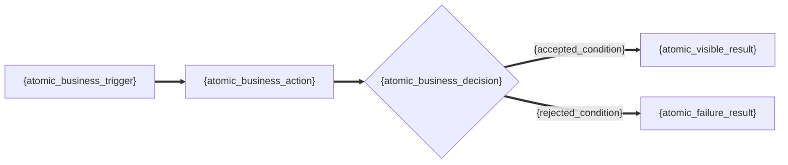
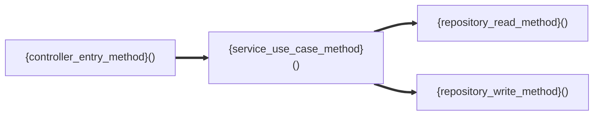

# {project_name} · {secondary_capability_name} 详细设计说明书

<!-- axis-template-use
默认生成 reader_profile=compact，只保留下面 1-6 六个读者章节。实际输出必须替换所有花括号内容，删除不适用的示例行与未采用的图；不得把模板变量、示例证据或可选 strict_full 说明留在成品中。
只有项目级 reader evidence card 经冻结提示词判定 `render_status=ready` 才能套用本模板；`blocked` 时必须补证，不得用通用角色、通用流程或内部方法伪接口填满模板。
只有证据完整且读者明确需要逐字段、事务与安全审计时，才使用文末 axis-strict-full-profile 扩展，并把下方 metadata 改为 reader_profile=strict_full；不得用 compact 标识承载完整展开。strict_full 不是默认展示方式。
-->

<!-- axis-document-metadata
reader_profile=compact
secondary_reader_contract=participant_flow_interface_v1
document_status=review
revision={revision}
level1_capability_id={level1_capability_id}
secondary_capability_id={secondary_capability_id}
business_ids={business_ids}
source_commit={source_commit}
interface_design_status={detailed_or_not_applicable}
interface_coverage={complete_partial_or_not_applicable}
interface_gap_id={gap_id_or_not_applicable}
interface_not_applicable_reason={reason_without_spaces_or_delete_when_detailed}
interface_not_applicable_evidence={exact_repository_path_line_symbol_or_delete_when_detailed}
-->

[返回能力总览](../../detailed-design.md) · [上一个二级能力](../{previous_secondary_capability_id}/detailed-design.md) · [下一个二级能力](../{next_secondary_capability_id}/detailed-design.md)

本文件只说明一个可独立评审的业务结果，源码定位统一显示 `文件名:起始行-结束行#符号`。

## 1. 能力定位与边界

| 项目 | 内容 |
| --- | --- |
| 负责的业务结果 | {independently_reviewable_business_outcome} |
| 用户可见结果 | {user_visible_result} |
| 纳入范围 | {included_scope} |
| 不包含 | {non_goals} |
| 证据 | `{evidence_file_name}:{begin_line}-{end_line}#{symbol}` |

<!-- axis-evidence: {boundary_evidence_path_begin_end_symbol} -->
<!-- axis-boundary-machine-table
| 字段 | 内容 |
| --- | --- |
| `level1_capability_id` | `{level1_capability_id}` |
| `secondary_capability_id` | `{secondary_capability_id}` |
| `business_ids` | `{business_ids}` |
| 负责的业务结果 | {independently_reviewable_business_outcome} |
| 纳入范围 | {included_scope} |
| 不包含 | {non_goals} |
| 证据 | `{boundary_evidence_path_begin_end_symbol}` |
-->

## 2. 参与者、职责与权限

| 参与者 | 参与类型 | 业务职责 | 参与步骤 | 权限与数据范围 |
| --- | --- | --- | --- | --- |
| {concrete_actor_or_business_participant} | {业务角色_or_外部系统_or_内部业务能力_or_自动任务} | {business_responsibility} | `{participating_flow_step_ids}` | {permission_policy_and_data_scope} |

<!-- axis-evidence: {authorization_or_scope_evidence} -->
<!-- axis-access-matrix-machine-table
| 主体/角色 | 所需权限/策略 | `api_id` | 可调用接口/能力 | 数据范围 | 授权证据 |
| --- | --- | --- | --- | --- | --- |
| {concrete_actor_or_role} | {permission_code_authentication_or_policy} | `{api_id}` | `{method_and_path_or_event_topic_job_command}` | {tenant_organization_resource_or_public_scope} | `{authorization_or_scope_evidence}` |
-->

<!-- axis-authoring-contract
读者表一行只表达一个具体参与者在本能力中的职责及参与步骤；参与类型只能是“业务角色”“外部系统”“内部业务能力”“自动任务”。不得使用“用户”“系统”“相关人员”等泛化角色，也不得把 Controller、Service、Listener、Repository、Mapper、状态机、监听器、调度器、接收器、消费者等实现组件当成业务参与者；应提升为有证据的业务能力或自动任务，实现名称只留在隐藏证据和方法定位。不得写“发起有证据支持的契约，并接收可见业务结果”“复核权威和业务前置状态”等可复用脚手架。隐藏 access matrix 只记录真实 caller 或 producer，并对每个 actor × api 单独写一行，同一行不得合并多个接口；consumer 或 handler 只在流程映射中标注，不得伪装成调用方。权限填写真实权限码、authenticated、public、可信内部边界或有证据的资源归属规则；不得写“执行已授权流程”等泛化结论。证据不足时写入第 6 章缺口，不推断角色、职责或数据范围。
-->

## 3. 能力流程

| 步骤 | 参与者 | 业务动作 | 前置状态/条件 | 结果/下一状态与下一步 | 失败/补偿 |
| --- | --- | --- | --- | --- | --- |
| `{flow_step_id}` | {concrete_actor_or_role} | {one_atomic_business_action} | {precondition_or_current_state} | {business_result_or_next_state}；下一步：`{next_flow_step_ids_or_结束}` | {failure_rejection_or_compensation} |

<!-- axis-evidence: {flow_evidence_path_begin_end_symbol} -->
<!-- axis-flow-step-machine-table
| 步骤 | 参与者 | `api_id` | 契约关系 | 证据 |
| --- | --- | --- | --- | --- |
| `{flow_step_id}` | {concrete_actor_or_role} | `{api_id_or_not_applicable}` | caller / producer / consumer / handler / not_applicable | `{flow_step_evidence_path_begin_end_symbol}` |
-->
<!-- axis-capability-flow-machine-table
| 项目 | 内容 |
| --- | --- |
| `level1_journey_id` | `{level1_journey_id}` |
| `flow_id` | `{flow_id}` |
| 参与 `api_id` | `{participating_api_ids}` |
| 上游契约/触发 | `{upstream_api_event_job_or_command}` |
| 下游契约/结果 | `{downstream_api_event_job_or_command_or_result}` |
| 状态传递 | {cross_contract_rule_or_state_handoff} |
| 失败与补偿 | {failure_and_compensation} |
| 证据 | `{flow_evidence_path_begin_end_symbol}` |
-->

<!-- axis-authoring-contract
步骤表必须覆盖主流程、明确的拒绝分支和补偿；每行只有一个参与者和一个原子业务动作，参与者必须在第 2 章出现。“结果/下一状态与下一步”必须以“；下一步：”明确写出具体步骤 ID，多个分支可列多个 ID，终点写“结束”，使所有步骤都能从至少一个入口到达并最终抵达终点。不得写“复核调用权威”“形成并返回已锁定的业务结果”“返回不满足前置状态的拒绝结果”等通用三段式流程。隐藏 flow-step 表至少为每个可见步骤提供一行证据；一个步骤可用多行分别映射兼容路由或多份契约，一个契约也可映射多个真实参与步骤，不得为接口别名伪造重复业务步骤。HTTP 使用 caller/handler，EVENT 与 TOPIC 使用 producer/consumer，JOB 与 COMMAND 使用 caller/handler；只有 caller/producer 进入 access matrix。无直接契约的内部步骤只写一行 `api_id=not_applicable`、`契约关系=not_applicable`，不得与真实 `api_id` 混写。Mermaid 可选；一张图只表达业务动作、判断、状态或可见结果，每个节点只放一个最小业务单元，不出现类名、方法名、表名或多个动作的并列描述。没有分支或图不能提升理解时，删除图，只保留步骤表。
-->

## 4. 对象与规则

| 业务对象/规则 | 权威含义 | 状态/条件 | 约束或结果 | 证据 |
| --- | --- | --- | --- | --- |
| {business_object_or_rule} | {authoritative_business_meaning} | {state_or_condition} | {constraint_or_result} | `{evidence_file_name}:{begin_line}-{end_line}#{symbol}` |

<!-- axis-evidence: {object_or_rule_evidence_path_begin_end_symbol} -->
<!-- axis-object-rule-machine-table
| 字段 | 内容 |
| --- | --- |
| `rule_id` | `{rule_id}` |
| 权威来源 | {source_of_truth} |
| 触发 | {trigger} |
| 当前状态/条件 | {state_or_condition} |
| 下一状态/决策 | {constraint_or_result} |
| 证据 | `{object_or_rule_evidence_path_begin_end_symbol}` |
-->

## 5. 接口摘要

### 5.1 `{method_and_path_or_event_topic_job_command}`

| 项目 | 内容 |
| --- | --- |
| 接口/触发 | `{method_and_path_or_event_topic_job_command}` |
| 业务目的 | {business_purpose} |
| 调用方/参与者 | {caller_or_participant} |
| 前置条件/权限 | {business_precondition_and_permission} |
| 关键输入 | {business_relevant_input_summary_or_not_applicable} |
| 业务结果/状态变化 | {business_result_or_state_change} |
| 失败/拒绝条件 | {business_failure_or_rejection_condition} |
| 对应流程步骤 | `{flow_step_ids_directly_mapped_to_this_contract}` |
| 实现定位 | `{controller_file_name}:{begin_line}-{end_line}#{entry_method}` → `{service_file_name}:{begin_line}-{end_line}#{use_case_method}` |

<!-- axis-evidence: {controller_file_line_symbol} -->
<!-- axis-evidence: {service_file_line_symbol} -->
<!-- axis-evidence: {mapper_file_line_symbol_or_delete_this_line} -->
<!-- axis-evidence: {entity_file_line_symbol_or_delete_this_line} -->
<!-- axis-evidence: {test_file_line_symbol} -->
<!-- axis-interface-machine-table
| 项目 | 内容 |
| --- | --- |
| `level1_journey_id` | `{level1_journey_id}` |
| `flow_id` | `{flow_id}` |
| `api_id` | `{api_id}` |
| 契约类型 | HTTP / EVENT / TOPIC / JOB / COMMAND |
| 方法与完整路径或主题 | `{method_and_path_or_event_topic_job_command}` |
| 请求模型 | `{request_type}` |
| 响应模型 | `{response_type_or_not_applicable}` |
| parent `table_id` | `{parent_table_ids_or_not_applicable}` |
| 物理表 | `{physical_table_names_or_not_applicable}` |
| 状态 | 已实现 / 目标设计 / 缺失证据 |
-->
<!-- axis-implementation-machine-table
| 实现层 | 精确定位 | 职责 |
| --- | --- | --- |
| Controller/入口 | `{controller_file_line_symbol}` | {entry_responsibility} |
| Service/用例 | `{service_file_line_symbol}` | {use_case_responsibility} |
| Mapper/Repository | `{mapper_file_line_symbol_or_delete_this_row}` | {persistence_responsibility} |
| 实体/表 | `{entity_file_line_symbol_or_delete_this_row}` | {entity_table_responsibility} |
| 测试 | `{test_file_line_symbol}` | {test_responsibility} |
-->

<!-- axis-authoring-contract
每个真实 HTTP / EVENT / TOPIC / JOB / COMMAND 契约必须且只能拥有一个连续编号的 5.N 独立摘要；5.N 标题和九字段摘要必须对读者可见，不得藏入 HTML 注释。`COMMAND internal:Class.method`、`JOB internal:Class.method`、`COMMAND Class.method`、`JOB XxxJob.method` 与 `JOB XxxTask schedule` 一律不是契约，只能作为 implementation machine table 的实现定位；找不到真实边界时阻断生成并补证。标题和“接口/触发”只写一个具体契约，不得用顿号、斜杠或多行合并多个入口；规范化后的一个具体契约也不得用多个 `api_id` 重复表达。“调用方/参与者”列出流程映射到该契约的全部业务参与者，但 consumer/handler 不得因此进入 access matrix。“对应流程步骤”列出该契约直接发生的全部第 3 章步骤，使读者能从接口跳回业务流程；兼容路由可指向同一步，一个契约也可对应生产和消费等多个真实步骤。每个 5.N 内必须各自包含且只包含一个 interface machine table、一个 implementation machine table，以及能匹配本块可见短定位的完整路径证据；implementation machine table 的每个保留行必须在“精确定位”列恰好给出一个完整仓库路径锚点，没有精确证据的实现层删除该行并进入第 6 章缺口。每个可见短定位必须恰好匹配本 5.N implementation machine table 中的一个完整锚点，禁止借用其他 5.N 的机器表或证据。第 2 章隐藏 access matrix 的 `api_id` 集合必须与本章隐藏 interface machine table 的 `api_id` 集合完全一致。

接口摘要只列影响业务决策、权限或数据范围、状态、金额/数量/时间、敏感处理、可见结果或失败语义的字段。通用响应包裹、分页样板、链路字段和基础设施 DTO 字段只保留模型名，不逐字段展示。

方法图仅在调用关系需要澄清时使用；同一张图只选择一种视角：业务或方法。这里若使用方法图，每个方法节点只写一个具体方法调用，业务含义、输入、结果、异常和数据变化写在边或表格，不把方法名与动作说明混在节点中。
-->

<!-- axis-authoring-contract
无证据的入口进入缺口，不生成空摘要。仅当精确证据证明本能力没有任何契约时，metadata 使用 `interface_design_status=not_applicable`、`interface_coverage=not_applicable`、`interface_gap_id=not_applicable`、interface_not_applicable_reason 与 interface_not_applicable_evidence；删除全部 5.N、access/interface/implementation machine table，第 5 章只用一句读者可见原因和一个文件名短定位解释“为何没有契约”，完整路径留在紧邻的 axis-evidence 中。此时 flow-step 的每一行都必须映射 `not_applicable`。
-->

## 6. 缺口

| 类型 | 缺口 | 影响 | 下一步 | 状态 |
| --- | --- | --- | --- | --- |
| {missing_evidence_assumption_or_risk} | {gap_description} | {business_or_design_impact} | {required_evidence_or_decision} | {gap_status} |

<!-- axis-gap-machine-table
| 字段 | 内容 |
| --- | --- |
| `interface_gap_id` | `{gap_id_or_not_applicable}` |
| `interface_coverage` | `{complete_partial_or_not_applicable}` |
| 已检查范围 | {searched_scope} |
| 责任角色 | {owner_role} |
| 阻断级别 | {blocking_level} |
| 完整证据 | `{gap_evidence_path_begin_end_symbol_or_not_applicable}` |
-->

<!-- axis-strict-full-profile
以下仅定义可选 strict_full 展开契约，不是 compact 默认读者章节。只有 interface_coverage=complete、逐项证据齐全且读者明确要求审计级详情时，才把每个接口展开为 5.N.1 至 5.N.8，并把 metadata 切换为 reader_profile=strict_full；否则保持上面的接口摘要。生成成品时删除本说明块。

兼容名称：能力级流程与跨接口关系；本章只描述二级能力内部多个接口的编排；接口内部逻辑见各 `5.N.2`。
## 3. 能力级流程与跨接口关系
## 5. 接口详细设计
#### 5.1.1 接口清单与代码追溯
| 项目 | 内容 |
| 实现层 | 精确定位 | 职责 |
| 实体/表 | `{entity_file_line_symbol_or_not_applicable_evidence}`；`table_id={parent_table_ids_or_not_applicable}`；物理表 `{physical_table_names_or_not_applicable}` | {entity_table_responsibility_or_no_persistence_reason} |
#### 5.1.2 内部处理逻辑
处理说明：{concrete_internal_processing_summary}
| 步骤 | 方法 | 业务作用 | 数据/状态变化 | 失败处理 |
#### 5.1.3 请求字段
| 字段 | 位置 | 类型/必填 | 约束/枚举 | 业务语义/敏感处理 | 证据/状态 |
#### 5.1.4 响应字段
| HTTP/消息/执行状态 | 字段 | 类型/可空 | 业务语义/产生位置 | 证据/状态 |
#### 5.1.5 错误码与异常映射
#### 5.1.6 认证与授权执行
#### 5.1.7 事务、并发、性能与容错
#### 5.1.8 安全、测试与验收
### 5.2 `{next_method_and_path_or_event_topic_job_command}`
#### 5.2.1 接口清单与代码追溯
#### 5.2.2 内部处理逻辑
#### 5.2.3 请求字段
#### 5.2.4 响应字段
#### 5.2.5 错误码与异常映射
#### 5.2.6 认证与授权执行
#### 5.2.7 事务、并发、性能与容错
#### 5.2.8 安全、测试与验收

strict_full 仍只展示业务相关字段；每个方法节点只写一个具体方法调用；完整路径、ID、coverage、授权证据、table_id、源码关系与验收追溯继续放在机器注释中。interface_not_applicable_reason 与 interface_not_applicable_evidence 仅用于精确证据证明无契约的分支。
-->
